# Oakfield Eco Farm

This website is inspired by a local Eco Farm in my area that does not have their own website. I love what they do and I thought it 
would be fitting to base my idea around them.

The site shows thewhat the farm is about, information about the opening times of the on site shop, and lets the customer sign up for deliveries of organic vegetables delivered to their door.

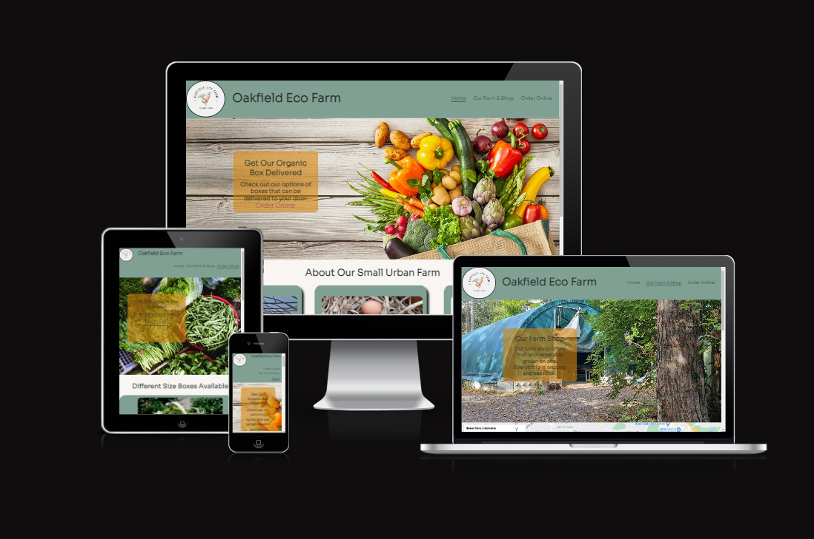
### Here is a live link: [Oakfield Eco Farm](https://angmaher.github.io/Oakfield-Project-1/)

# Technology used

This site was built using HTML CSS [GitHub Pages](https://pages.github.com/)

# Wireframe screenshots

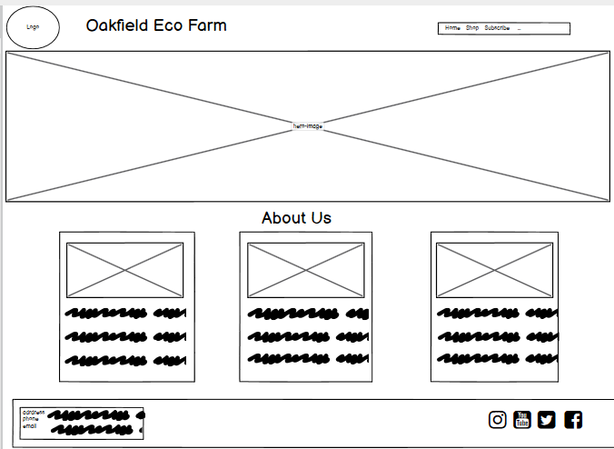 
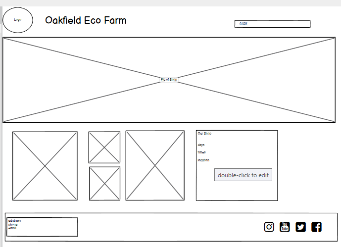 
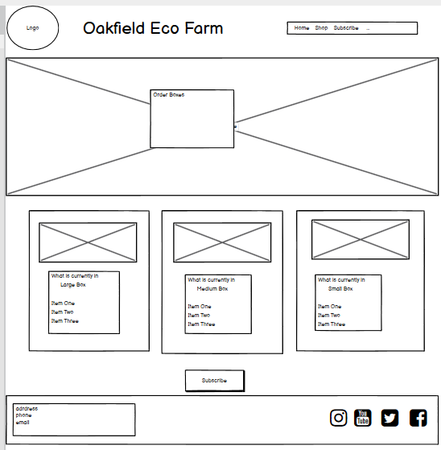 
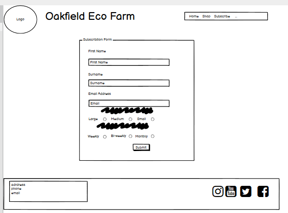 

# Features

## colors 

 I used [Coolors](https://coolors.co) to help me pick the colours I was looking for and to get the values for them. I wanted to keep it earthy and based the colour system around the colour of a carrot.  I used a light green in the header and footer and any boxes. The headings and text is a very dark green. The the transparent boxes and hover activity is an orange colour. Behind the boxes I have used an off white colour, as I felt white was not warm enough for the site.

## Header

* In the header I have a logo for thw farm. I used [Canva](https://canva.com) to create the logo and I think brings a great addition to the page.
* There is the name of the farm also in the header and it is also a link to the home page, so no matter where you are on the site the name will bring you home.

### Navigation
* Featured at the top of the page to  the left shows the farm name, which links to the home page.
* On the right hand side there are further links: Home, Our Farm & Shop, Order Online.
* The navigation is using a font that is soft amd rounded with a colour that contrasts well with the background.

### Logo
* Featured on the left hand corner of the page is a logo I created myself using [Canva](https://canva.com).

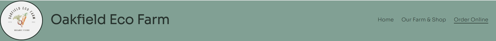

## Hero Section
* There is a hero image throughout the whole site and each page has a different image.
* On this section there is a transparent bos with information, in a contrasting colour of orange.

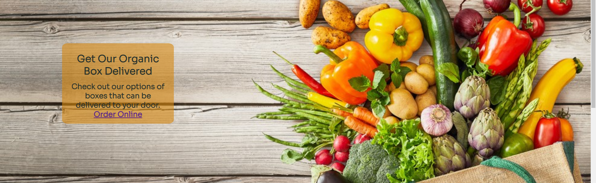

## Content in styled Boxes 

* Throughout the site the information and content is presented in clear easy to read styled boxes.
* This makes the site feel uncluttered.

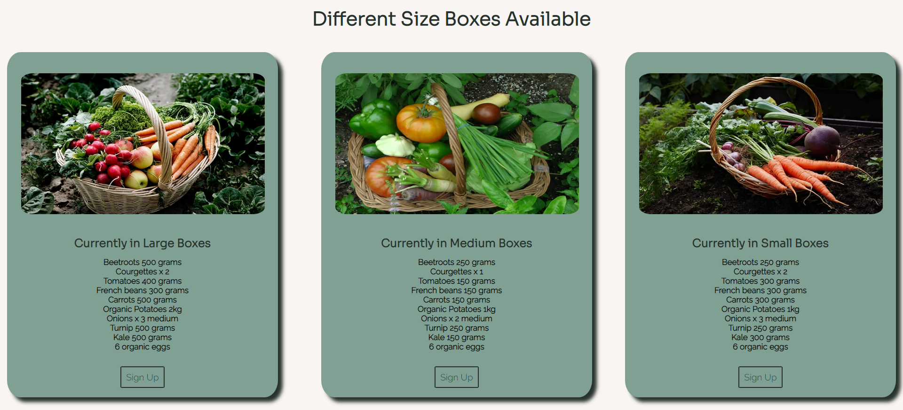

## Order Form

* The Eco Farm organises and delivers boxes of vegetables to the local area. 
* The site provides a form that can collect the information of interested people and the farm can then contact them to proceed.

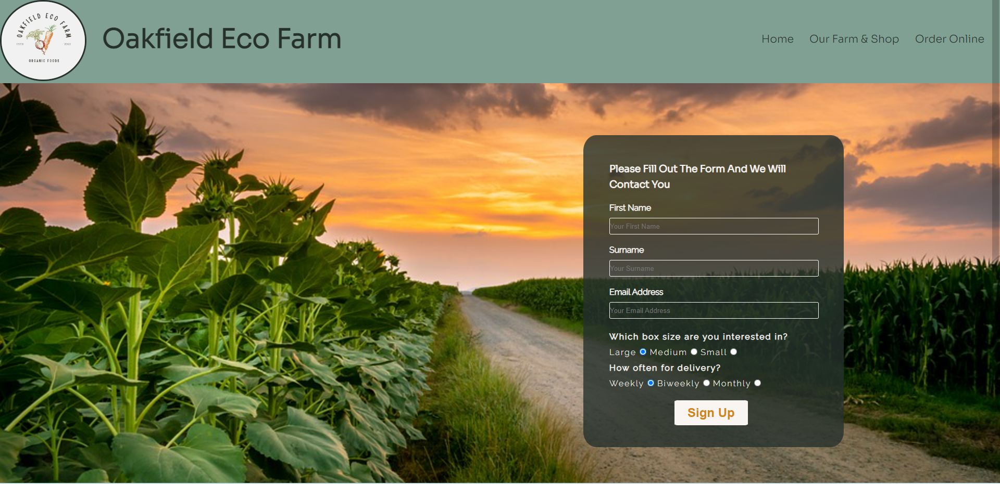

## Footer

* The footer is consistent across the whole site.
* It contains contact information and links to external social media platforms.

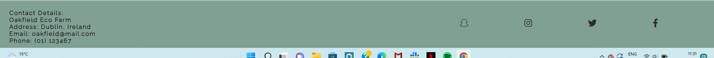

# Testing

* I confirm that the project is responsive and adapts to different screen sizes.
* I tested the form and made sure it asked for correct email address and that all fields were filled in.
* Once the project was deployed I tested it on many different devices, ipad, ipad mini, 3 different size iphones, samgung s10 and samgung s21.

# Validator Team

* HTML
    * I checked my HTML code with w3c and it came back with no errors.
* CSS
   * I checked my CSS code with jigsaw and there was no errors.

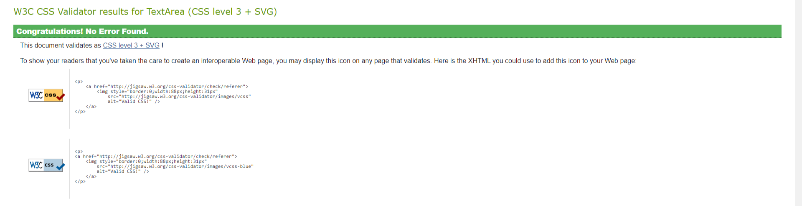

* Accessibility
    * I checked they accessibility of the site by using Lighthhouse on devtools.

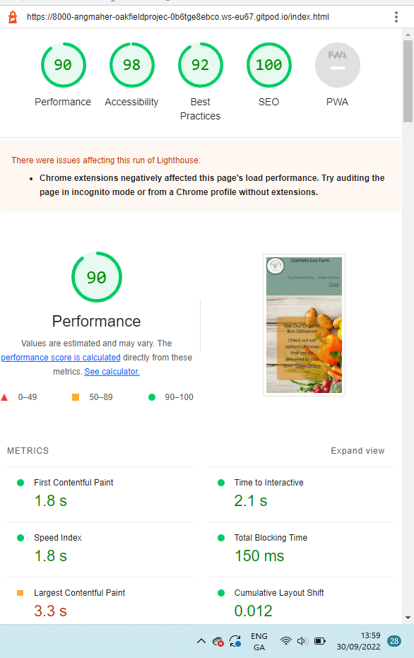

# Deployment
* This site was deployed using GitHub pages.
    * Here is a live link: [Oakfield Eco Farm](https://angmaher.github.io/Oakfield-Project-1/)

# Didnt get done
* There are no bugs in the project.
* I would have liked to have a dropdown menu for the smallest mobile screen sizes, but felt it is beyond the scope of what I have learnt so far in the course.
* In future the site can expand to include an online shop

# Credit
* I used Balsamiq to create the wireframes, google.fonts to select font styles, font awsome for icon.
* Used the loving running project and the coffee shop program for inspiration and examples, and applied to my own project using my own style. In particular I looked at the hero section and how to line up three div sections side by side. Mostly I went over my notes and relooked at many videos from the course. 
* I used canva.com to create a logo for the wesite.
* I used pexels for photographs and a local farm in my area for pictures of the shop and about the farm section.
* I created the logo using canva.com.
* My mentor Jubril gave me great advise which I followed all except the dropdown menu. 